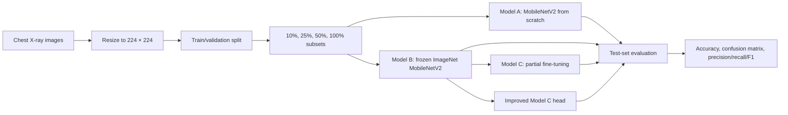

# Pneumonia image classification with MobileNetV2

An experimental deep-learning project studying how transfer learning and training-set size affect chest X-ray classification. The repository compares MobileNetV2 trained from scratch, a frozen ImageNet feature extractor, partial fine-tuning, and an improved classification head using 10%, 25%, 50%, and 100% of the available training pool.

> This repository is an educational research project, not a clinical diagnostic system. The models have not been validated for medical use.

## Research questions

The notebooks address two related questions:

1. How much does ImageNet transfer learning help when only a small fraction of labeled chest X-rays is available?
2. Does partially fine-tuning MobileNetV2 improve performance beyond a frozen pretrained backbone?

Two classification tasks are implemented:

- **Task 1:** NORMAL versus PNEUMONIA
- **Task 2:** bacterial versus viral pneumonia

Several notebooks also attempt a single three-output classifier for NORMAL, bacterial pneumonia, and viral pneumonia. See [Three-class experiment status](#three-class-experiment-status) for an important limitation of the saved runs.

## Dataset

The experiments use the [Chest X-Ray Images (Pneumonia) dataset on Kaggle](https://www.kaggle.com/datasets/paultimothymooney/chest-xray-pneumonia), which contains pediatric chest radiographs arranged into training, validation, and test directories.

The dataset is not committed to this repository. Download and extract it so the repository root contains:

```text
chest_xray/
├── train/
│   ├── NORMAL/
│   └── PNEUMONIA/
├── val/
│   ├── NORMAL/
│   └── PNEUMONIA/
└── test/
    ├── NORMAL/
    └── PNEUMONIA/
```

For the bacterial-versus-viral task, the notebooks expect the pneumonia images to be separated into class directories:

```text
chest_xray/{train,test}/PNEUMONIA/
├── bacteria/
└── virus/
```

The code in `main.ipynb` includes file-organization steps for creating these subdirectories from filename labels. Review those steps before running them because they move or copy dataset files.

The saved notebook runs report:

| Task | Training images | Test images | Test class counts |
|---|---:|---:|---|
| NORMAL vs PNEUMONIA | 5,232 | 624 | 234 normal, 390 pneumonia |
| Bacteria vs virus | 3,883 | 390 | 242 bacterial, 148 viral |

A portion of each training pool is held out for validation, and model comparisons use 10%, 25%, 50%, and 100% of the remaining training pool.

## Experimental design



Common settings in the modular notebooks:

- input size: 224 × 224 RGB
- batch size: 32
- maximum training length: 20 epochs
- subset fractions: 10%, 25%, 50%, and 100%
- optimizer: Adam
- evaluation: loss, accuracy, confusion matrices, and scikit-learn classification reports

### Model A — training from scratch

`Model A.ipynb` creates MobileNetV2 with `weights=None` and trains the network end to end. It uses Adam with a learning rate of `1e-3`.

### Model B — frozen transfer learning

`Model B.ipynb` initializes MobileNetV2 with ImageNet weights and freezes the backbone. Its classification head contains global average pooling, a 128-unit dense layer, dropout, and a task-specific softmax output.

The notebook saves one set of weights for every task and training fraction:

```text
B1_10%.h5   B1_25%.h5   B1_50%.h5   B1_100%.h5
B2_10%.h5   B2_25%.h5   B2_50%.h5   B2_100%.h5
```

Here, B1 denotes NORMAL versus PNEUMONIA and B2 denotes bacterial versus viral pneumonia.

### Model C — partial fine-tuning

`Model C.ipynb` starts from the corresponding Model B weights and unfreezes the final 20 MobileNetV2 layers. This tests whether task-specific feature adaptation improves the frozen-backbone baseline.

### Improved Model C

`Model C improve.ipynb` also initializes from Model B, then uses a regularized classification head with a dense layer and `Dropout(0.4)`, early stopping, and partial backbone unfreezing.

## Repository structure

```text
.
├── README.md
├── LICENSE
├── .gitignore
├── models/
│   ├── best_model.keras
│   ├── B1_10%.h5
│   ├── B1_25%.h5
│   ├── B1_50%.h5
│   ├── B1_100%.h5
│   ├── B2_10%.h5
│   ├── B2_25%.h5
│   ├── B2_50%.h5
│   └── B2_100%.h5
└── notebooks/
    ├── main.ipynb
    ├── Model A.ipynb
    ├── Model B.ipynb
    ├── Model C.ipynb
    ├── Model C improve.ipynb
    ├── Model A-3Classifier.ipynb
    ├── Model B-3Classifier.ipynb
    └── Model C improve-3Classifier.ipynb
```

## Notebook guide

| Notebook | Purpose |
|---|---|
| `main.ipynb` | Initial end-to-end exploration, dataset organization, baseline CNNs, MobileNetV2 experiments, plots, and confusion matrices |
| `Model A.ipynb` | From-scratch MobileNetV2 comparison for the two binary tasks |
| `Model B.ipynb` | Frozen ImageNet MobileNetV2 experiments and saved B1/B2 weight files |
| `Model C.ipynb` | Partial fine-tuning initialized from Model B weights |
| `Model C improve.ipynb` | Fine-tuning with an improved regularized classification head |
| `Model A-3Classifier.ipynb` | Intended three-output from-scratch experiment |
| `Model B-3Classifier.ipynb` | Intended three-output frozen-backbone experiment |
| `Model C improve-3Classifier.ipynb` | Intended three-output fine-tuning experiment |

Run the notebooks from the repository root. They use relative paths such as `Path("chest_xray")` and save model files to the current working directory unless you edit the paths.

## Installation

A GPU is recommended but not required. The saved notebook metadata records a TensorFlow 2.11 GPU environment.

Create an environment, for example:

```bash
conda create -n pneumonia-classification python=3.10 -y
conda activate pneumonia-classification
python -m pip install "tensorflow~=2.11" jupyter numpy matplotlib scikit-learn
```

Depending on your hardware and platform, use the TensorFlow installation instructions appropriate for CPU, NVIDIA GPU, or Apple silicon.

Launch Jupyter from the repository root:

```bash
jupyter notebook
```

Then start with `notebooks/Model A.ipynb`, `Model B.ipynb`, or `Model C.ipynb`. If a notebook cannot find `chest_xray/`, verify the notebook server's working directory.

## Reproducing the experiments

1. Download and extract the Kaggle dataset.
2. Arrange the binary classes under `chest_xray/train` and `chest_xray/test`.
3. For Task 2, separate pneumonia images into `bacteria/` and `virus/` directories using the filename labels or the organization code in `main.ipynb`.
4. Run `Model A.ipynb` for the from-scratch baseline.
5. Run `Model B.ipynb` to train the frozen-backbone models and save B1/B2 weights.
6. Place the saved B1/B2 files where `Model C.ipynb` and `Model C improve.ipynb` expect them. The committed copies are in `models/`; update the notebook paths or run from that directory as appropriate.
7. Run the Model C notebooks for partial fine-tuning.
8. Compare test accuracy and class-specific precision, recall, and F1, not validation accuracy alone.

The subset construction uses TensorFlow dataset `take()` operations. Exact reproducibility therefore depends on directory traversal order, shuffling behavior, TensorFlow version, and random seeds; the notebooks do not consistently fix all random seeds.

## Recorded binary-task results

The following values are read from the saved notebook outputs and refer to test accuracy, not validation accuracy.

### Task 1: NORMAL versus PNEUMONIA

| Training fraction | Model A: scratch | Model B: frozen | Model C: fine-tuned | Improved C |
|---:|---:|---:|---:|---:|
| 10% | 61.4% | 89.9% | 87.8% | 85.3% |
| 25% | 65.1% | 88.0% | 90.2% | 90.4% |
| 50% | 62.8% | 91.2% | 89.3% | 92.5% |
| 100% | 68.4% | 92.5% | 89.9% | 95.7% |

### Task 2: bacterial versus viral pneumonia

| Training fraction | Model A: scratch | Model B: frozen | Model C: fine-tuned | Improved C |
|---:|---:|---:|---:|---:|
| 10% | 59.2% | 78.7% | 86.2% | 81.0% |
| 25% | 54.4% | 88.2% | 87.7% | 87.2% |
| 50% | 62.1% | 88.5% | 88.7% | 87.4% |
| 100% | 61.0% | 88.2% | 88.2% | 87.9% |

These results support the central experimental finding: ImageNet transfer learning substantially outperformed MobileNetV2 trained from scratch, especially for the pneumonia-detection task. Fine-tuning was not uniformly superior to the frozen backbone; its value depended on the task, training fraction, and classification head.

The test set is imbalanced. Accuracy should therefore be interpreted alongside the confusion matrices and per-class precision, recall, and F1 reports saved in the notebooks.

## Three-class experiment status

The filenames and model heads in the `*-3Classifier.ipynb` notebooks indicate an intended three-class task:

```text
NORMAL
bacteria
virus
```

However, the saved executions report only two discovered directories:

```text
Found 5232 files belonging to 2 classes.
Classes: ['NORMAL', 'PNEUMONIA']
```

Consequently, the recorded “3-class” evaluations are not verified three-class experiments; several outputs are binary NORMAL-versus-PNEUMONIA results despite three-unit output layers or three-class comments. Before rerunning these notebooks:

1. create top-level `NORMAL/`, `bacteria/`, and `virus/` directories for both train and test data;
2. confirm that `image_dataset_from_directory(...).class_names` returns all three names;
3. confirm the output layer has three units;
4. rerun training and replace the saved outputs.

This limitation is documented explicitly so the repository does not overstate its current multi-class evidence.

## Saved models

- `models/B1_*.h5` and `models/B2_*.h5` are Keras HDF5 weight files generated by Model B for each training fraction.
- `models/best_model.keras` is the full Keras model checkpoint written by the initial workflow in `main.ipynb`.
- The model files are approximately 9.9–11.3 MB each and are committed directly to Git.

Example loading patterns:

```python
import tensorflow as tf

# Full model from main.ipynb
model = tf.keras.models.load_model("models/best_model.keras")
```

The B1/B2 files were saved with `save_weights()`; reconstruct the matching architecture before loading them:

```python
model = make_classifier(num_classes=2)
model.load_weights("models/B1_100%.h5")
```

The exact helper function is defined in `notebooks/Model B.ipynb`. Loading an HDF5 weight file into a different head or layer layout can fail or silently skip incompatible weights when mismatch-skipping options are used.

## Limitations

- This is a retrospective notebook experiment on a public dataset, not a prospective clinical study.
- The pediatric dataset may not generalize to adults, other institutions, devices, or acquisition protocols.
- The original test split is imbalanced and relatively small.
- Notebook execution order and working-directory assumptions affect reproducibility.
- Random seeds are not consistently fixed.
- Training subsets created with `take()` are not guaranteed to be stratified.
- The repository does not include an environment lock file or automated training pipeline.
- Model selection and repeated experimentation on the same test split can produce optimistic estimates.
- The three-class experiments require corrected directory organization and fresh evaluation.
- Model outputs should not be used for patient care.

## Citation and attribution

If you use this repository, cite the original chest X-ray dataset and the relevant software:

- Kermany et al., *Identifying Medical Diagnoses and Treatable Diseases by Image-Based Deep Learning*, Cell (2018)
- TensorFlow and Keras
- MobileNetV2
- scikit-learn
- Matplotlib

Also follow the Kaggle dataset's license and attribution requirements.

## License

The repository code is released under the [MIT License](LICENSE). Dataset and pretrained ImageNet weights remain subject to their own licenses and terms.
